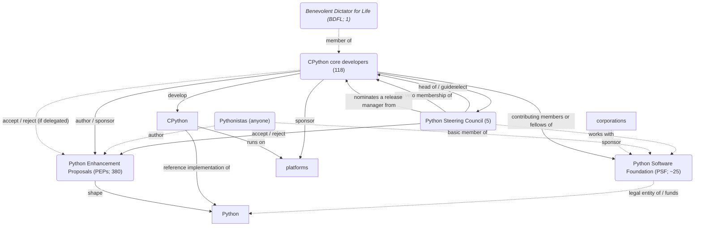

Organogram

<!--
1.
    - BDFL
        - josagos zsarnok (lesson 8: governance)
        - often delegates
        - now: emeritus & hierarchikus zsarnoksag & konszenzus alapu demokracia
    - what is Python?
2.
    - mintamegvalositasa: CPython
    - there are also other implementations
3.
    - core devs
    - PEPs: we'll get to them later
    - Steering Council
    - release managers
4.
    - PSF
        - supports / oversees everything
            - hosting
        - legal entity
        - Zero-Clause BSD license with an addition
            - public domain-like
-->