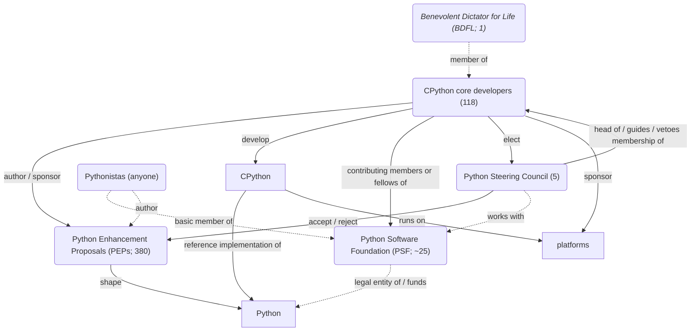
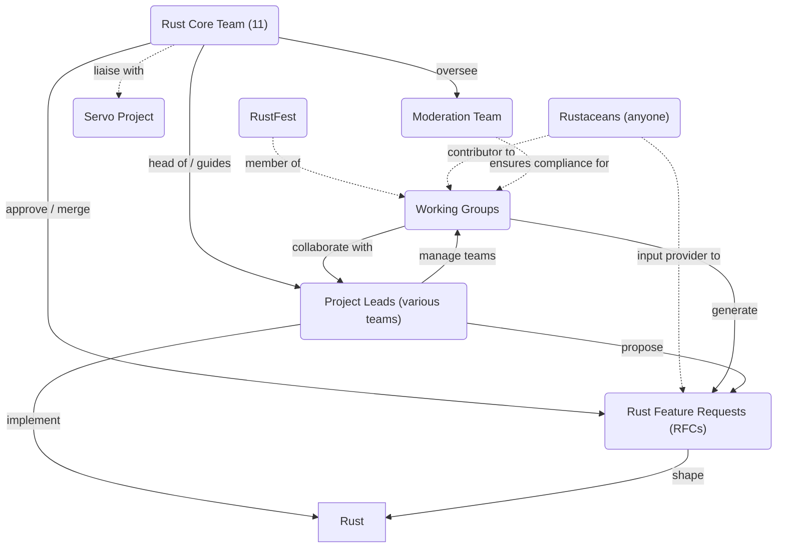

# The development process of Python

---
layout: center
---


<!--
- invented by Guido van Rossum (xidoː vɑn rɔsʏm) (https://translate.google.com/?sl=nl&tl=en&text=Guido%20van%20Rossum&op=translate)
    - in 1991
    - at the Dutch MTA
- continued working on it part-time at Google (2005–2012) and Dropbox (2013–2019)
-->

---
layout: center
# zoom: 2
---

```mermaid

```

---
layout: iframe
url: https://docs.python.org/3/reference/index.html

transition: slide-left
---

---
layout: iframe
url: https://docs.python.org/3/library/index.html

transition: slide-up
---

---
layout: center
zoom: 2

transition: fade
---

<v-clicks>

```py {1|2|3|4|2}
implementations = [
    "CPython",  # NOT Cython
    "PyPy"  # NOT PyPI
    "Python.NET"  # pythonnet
]
```

</v-clicks>

<!--
- [click:2] Cython is a superset of Python that supports calling C functions and types
- If you love recursion:
    - [click] A faster Python written in R(estricted)Python, a subset of Python
    - PyPy also has a tracing JIT compiler. PyPy was funded by the EU by 1 billion HUF and by the Mozilla Foundation by 100 million HUF
- [click] Embedding Python into .NET (NuGet package) & .NET into Python (PyPI package)
    - Funded by Microsoft

- [click] CPython is the reference implementation of Python
- 
-->

---
layout: center
zoom: 2.5
---



<!--
- PSF
    - supports / oversees everything
        - hosting
- BDFL-emeritus
-->

---
layout: center
zoom: 2.5
---



---
# layout: iframe

transition: slide-up
---

<SlidevVideo controls autoplay autoreset="click">
  <source src="/programming-languages.mp4" type="video/mp4" />
</SlidevVideo>

<!--
- `0.9` @ 1991
- `2.0` @ 2000
- `3.0` @ 2008 (thanks to Google)
-->

---
layout: center
class: text-center
---

<PoweredBySlidev mt-10 />
