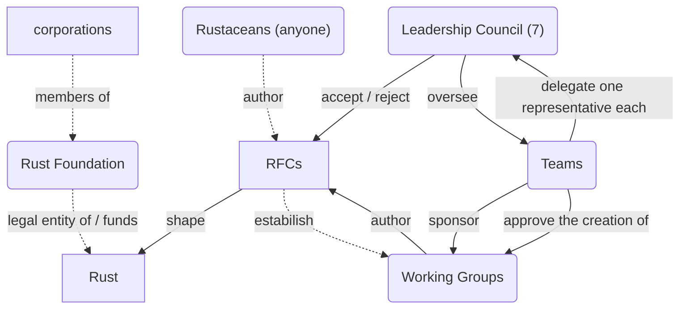
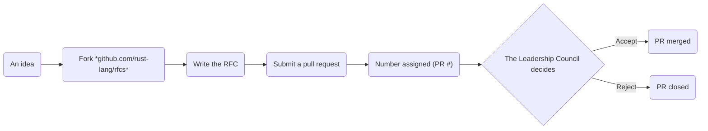

Gyöngyösi Máté

# The development organization of Python

<!--
- ...
-->

---
layout: center

transition: slide-left
---


<!--
- invented by Guido van Rossum (xidoː vɑn rɔsʏm) (https://translate.google.com/?sl=nl&tl=en&text=Guido%20van%20Rossum&op=translate)
    - in 1991
    - at the Dutch MTA
- continued working on it part-time at Google (2005–2012) and Dropbox (2013–2019)
-->

---
# layout: iframe

transition: slide-up
---

<SlidevVideo controls autoplay autoreset="click">
  <source src="/programming-languages.mp4" type="video/mp4" />
</SlidevVideo>

<!--
- `0.9` @ 1991
- `2.0` @ 2000
- `3.0` @ 2008 (thanks to Google)
-->

---
src: ./pages/Python.md

transition: slide-up
---

---
layout: iframe
url: https://docs.python.org/3/reference/index.html

transition: slide-left
---

---
layout: iframe
url: https://docs.python.org/3/library/index.html

transition: slide-down
---

---
src: ./pages/Python.md

transition: slide-up
---

---
layout: center
zoom: 2

transition: slide-down
---

<v-clicks>

```py{2|3|4|2}{lines: true}
implementations = [
    "CPython",  # NOT Cython
    "PyPy"  # NOT PyPI
    "Python.NET"  # pythonnet
]
```

</v-clicks>

<!--
- CPython is the reference implementation of Python
    - Cython is a superset of Python that supports calling C functions and types
- If you love recursion:
    - [click:2] A faster Python written in R(estricted)Python, a subset of Python
    - PyPy also has a tracing JIT compiler. PyPy was funded by the EU by 1 billion HUF and by the Mozilla Foundation by 100 million HUF
- [click] Embedding Python into .NET (NuGet package) & .NET into Python (PyPI package)
    - Funded by Microsoft
-->

---
src: ./pages/Python.md

transition: slide-up
---

---
layout: statement

transition: slide-down
---

https://www.python.org/users/membership/

---
src: ./pages/Python.md

transition: slide-left
---

---
layout: center
zoom: 2

transition: slide-left
---



<!--
- MIT license and the Apache 2.0 License
    - portions covered by BSD-like licenses
-->

---
layout: center
zoom: 2.5
---



<!--
- *"As an alternative, we could adopt an even stricter RFC process than the one proposed here. If desired, we should likely look to Python’s PEP process for inspiration."*
-->

---
layout: center
zoom: 2.5
---


---
zoom: 0.54
---

# References

- [1] C. F. Bolz-Tereick, ‘The First 15 Years of PyPy — a Personal Retrospective’. Accessed: Dec. 08, 2024. [Online]. Available: https://pypy.org/posts/2018/09/the-first-15-years-of-pypy-3412615975376972020.html
- [2] bstrie and B. Anderson, ‘0002-rfc-process’. Mar. 11, 2014. Accessed: Dec. 10, 2024. [Online]. Available: https://rust-lang.github.io/rfcs/0002-rfc-process.html
- [3] Cython developers, ‘About Cython’. Accessed: Dec. 08, 2024. [Online]. Available: https://cython.org/
- [4] S. J. Turner et al., ‘3392-leadership-council’. Aug. 01, 2022. Accessed: Dec. 10, 2024. [Online]. Available: https://rust-lang.github.io/rfcs/3392-leadership-council.html
- [5]. NET Foundation, ‘Python.NET documentation’. 2022. Accessed: Dec. 08, 2024. [Online]. Available: https://pythonnet.github.io/pythonnet/
- [6]. NET Foundation, .‘NET Foundation’. 2024. Accessed: Dec. 08, 2024. [Online]. Available: https://dotnetfoundation.org/
- [7] Python Software Foundation, ‘Experts index’. 2011. Accessed: Dec. 10, 2024. [Online]. Available: https://devguide.python.org/core-developers/experts/#
- [8] Python Software Foundation, ‘About the Python Software Foundation’. 2024. Accessed: Dec. 09, 2024. [Online]. Available: https://www.python.org/psf/about/
- [9] Python Software Foundation, ‘The Python Language Reference’. 2024. Accessed: Dec. 08, 2024. [Online]. Available: https://docs.python.org/3/reference/index.html
- [10] Python Software Foundation, ‘The Python Standard Library’. 2024. Accessed: Dec. 08, 2024. [Online]. Available: https://docs.python.org/3/library/index.html
- [11] Rust Team, ‘Governance’. Accessed: Dec. 10, 2024. [Online]. Available: https://www.rust-lang.org/governance
- [12] The PyPy Team, ‘PyPy’. 2024. Accessed: Dec. 08, 2024. [Online]. Available: https://pypy.org/
- [13] The Python core team and community, ‘PEP 13 – Python Language Governance’. Dec. 16, 2018. Accessed: Dec. 09, 2024. [Online]. Available: https://peps.python.org/pep-0013/
- [14] G. Van Rossum, ‘Personal Home Page’. Accessed: Dec. 08, 2024. [Online]. Available: https://gvanrossum.github.io
- [15] M. Von Löwis and B. Cannon, ‘PEP 11 – CPython platform support’. Jul. 07, 2002. Accessed: Dec. 10, 2024. [Online]. Available: https://peps.python.org/pep-0011/
- [16] B. Warsaw, J. Hylton, D. Goodger, and A. Coghlan, ‘PEP 1 – PEP Purpose and Guidelines’. Jun. 13, 2000. Accessed: Dec. 09, 2024. [Online]. Available: https://peps.python.org/pep-0001/
- [17] Wikipedia contributors, ‘Bootstrapping (compilers) — Wikipedia, The Free Encyclopedia’. 2024. [Online]. Available: https://en.wikipedia.org/w/index.php?title=Bootstrapping_(compilers)&oldid=1237819001
- [18] Wikipedia contributors, ‘Guido van Rossum — Wikipedia, The Free Encyclopedia’. 2024. [Online]. Available: https://en.wikipedia.org/w/index.php?title=Guido_van_Rossum&oldid=1261004768
- [19] Wikipedia contributors, ‘Python (programming language) — Wikipedia, The Free Encyclopedia’. 2024. [Online]. Available: https://en.wikipedia.org/w/index.php?title=Python_(programming_language)&oldid=1261797535
- [20] Wikipedia contributors, ‘Python Software Foundation — Wikipedia, The Free Encyclopedia’. 2024. [Online]. Available: https://en.wikipedia.org/w/index.php?title=Python_Software_Foundation&oldid=1261952004
- [21] Wikipedia contributors, ‘Rust (programming language) — Wikipedia, The Free Encyclopedia’. 2024. [Online]. Available: https://en.wikipedia.org/w/index.php?title=Rust_(programming_language)&oldid=1261392251
- [22] Wikipedia contributors, ‘Self-hosting (compilers) — Wikipedia, The Free Encyclopedia’. 2024. [Online]. Available: https://en.wikipedia.org/w/index.php?title=Self-hosting_(compilers)&oldid=1234630482
- [23] Wikipedia contributors, ‘Tracing just-in-time compilation — Wikipedia, The Free Encyclopedia’. 2024. [Online]. Available: https://en.wikipedia.org/w/index.php?title=Tracing_just-in-time_compilation&oldid=1244249633
- [24] XAMPPRocky, N. Matsakis, and valgrimm, ‘2856-project-groups’. May 21, 2015. Accessed: Dec. 10, 2024. [Online]. Available: https://rust-lang.github.io/rfcs/2856-project-groups.html

---
class: text-center
---

# Made with

 Visual Studio Code
 `yt-dlp`
 `ffmpeg`
 Mermaid.js
 Zotero

<PoweredBySlidev/>

---
layout: statement

transition: slide-left
---

https://github.com/gy-mate/talks/tree/main/2024-12-10_BME_FLOSS_assignment

---
layout: center
zoom: 2.5
---

```python
sys.exit()
```
