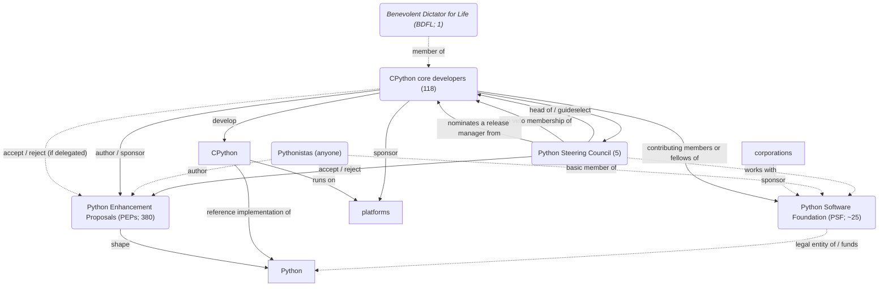
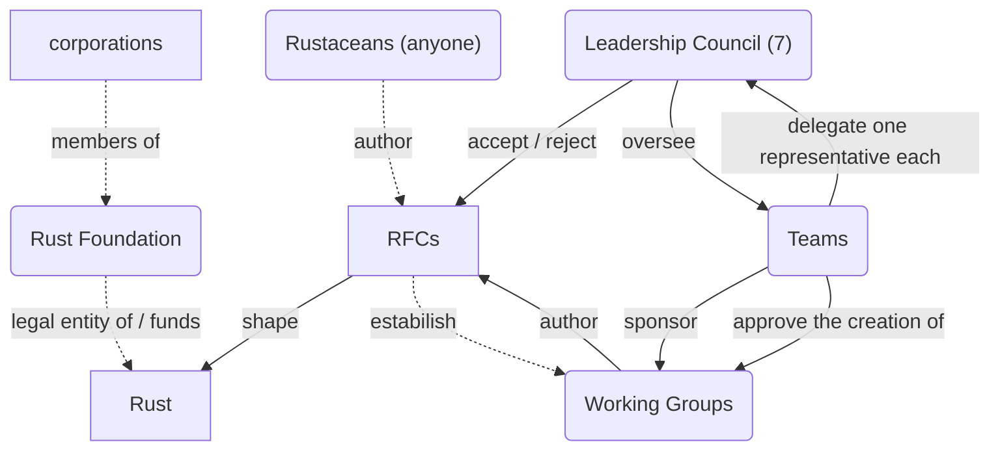
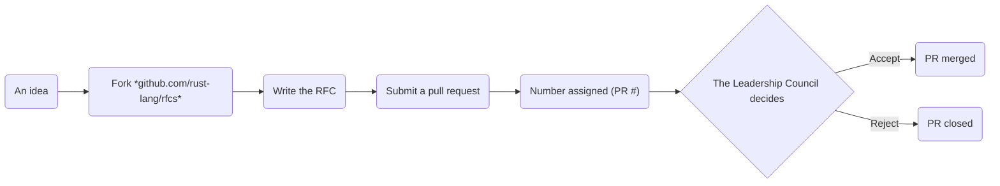

```mermaid
flowchart LR
    idea("An idea")
    post("Post to *discuss.python.org*")
    chance{"Is there any chance of acceptance?"}
    reject(["Rejected"])
    core{"Are any of the authors core developers?"}
    find("Find a sponsor")
    write("Write the PEP")
    PR("Submit a pull request to *github.com/python/peps*")
    editors{"Review of the PEP editors"}
    ID("Number assigned")
    merge("PR merged")
    discuss("Discuss on *discuss.python.org*")
    typing{"Is the PEP about typing?"}
    typing_issue("Open an issue at *github.com/python/typing-council*")
    recommendation("The Typing Council makes a recommendation to the Steering Council")
    issue("Open an issue at *github.com/python/steering-council*")
    nomination{"Does a core developer nominate themselves as a PEP-Delgate?"}
    delegate("The Steering Council searches for a PEP-Delegate")
    found("A PEP-Delegate is found")
    not_found("No PEP-Delegate was found")
    defer("The PEP is Deferred")
    decision{"The PEP-Delegate decides"}
    approve("Approved")
    council_decision{"The Steering Council decides"}
    accept(["Accepted"])

    idea --> post
    post --> chance
    chance -- No --> reject
    chance -- Yes --> core
    core -- No --> find
    find --> write
    core -- Yes --> write
    write --> PR
    PR --> editors
    editors -- Request changes --> write
    editors -- Approve --> ID
    ID --> merge
    merge --> discuss
    discuss --> typing
    typing -- Yes --> typing_issue
    typing_issue --> recommendation
    recommendation --> issue
    typing -- No --> issue
    issue --> nomination
    nomination -- No --> delegate
    delegate --> found
    delegate --> not_found
    not_found --> defer
    defer --> nomination
    nomination -- Yes --> found
    found --> decision
    decision -- Reject --> reject
    decision -- Approve --> approve
    approve --> council_decision
    council_decision -- Reject --> reject
    council_decision -- Accept --> accept
```

# The development process of Python

---
layout: center
---


<!--
- invented by Guido van Rossum (xidoː vɑn rɔsʏm) (https://translate.google.com/?sl=nl&tl=en&text=Guido%20van%20Rossum&op=translate)
    - in 1991
    - at the Dutch MTA
- continued working on it part-time at Google (2005–2012) and Dropbox (2013–2019)
-->

---
# layout: iframe

transition: slide-up
---

<SlidevVideo controls autoplay autoreset="click">
  <source src="/programming-languages.mp4" type="video/mp4" />
</SlidevVideo>

<!--
- `0.9` @ 1991
- `2.0` @ 2000
- `3.0` @ 2008 (thanks to Google)
-->

---
layout: iframe
url: https://docs.python.org/3/reference/index.html

transition: slide-left
---

---
layout: iframe
url: https://docs.python.org/3/library/index.html

transition: slide-up
---

---
layout: center
zoom: 2

transition: fade
---

<v-clicks>

```py {2|3|4|2}
implementations = [
    "CPython",  # NOT Cython
    "PyPy"  # NOT PyPI
    "Python.NET"  # pythonnet
]
```

</v-clicks>

<!--
- CPython is the reference implementation of Python
    - Cython is a superset of Python that supports calling C functions and types
- If you love recursion:
    - [click] A faster Python written in R(estricted)Python, a subset of Python
    - PyPy also has a tracing JIT compiler. PyPy was funded by the EU by 1 billion HUF and by the Mozilla Foundation by 100 million HUF
- [click] Embedding Python into .NET (NuGet package) & .NET into Python (PyPI package)
    - Funded by Microsoft
-->

---
layout: center
zoom: 2.5
---



<!--
- PSF
    - supports / oversees everything
        - hosting
- BDFL-emeritus
-->

---
layout: center
zoom: 2
---



---
layout: center
zoom: 2.5
---



<!--
*"As an alternative, we could adopt an even stricter RFC process than the one proposed here. If desired, we should likely look to Python’s PEP process for inspiration."*
-->

---
layout: center
zoom: 2.5
---



---
class: text-center
---

# Made with

 Visual Studio Code
 `yt-dlp`
 `ffmpeg`
 Mermaid.js
 Zotero

<PoweredBySlidev/>
