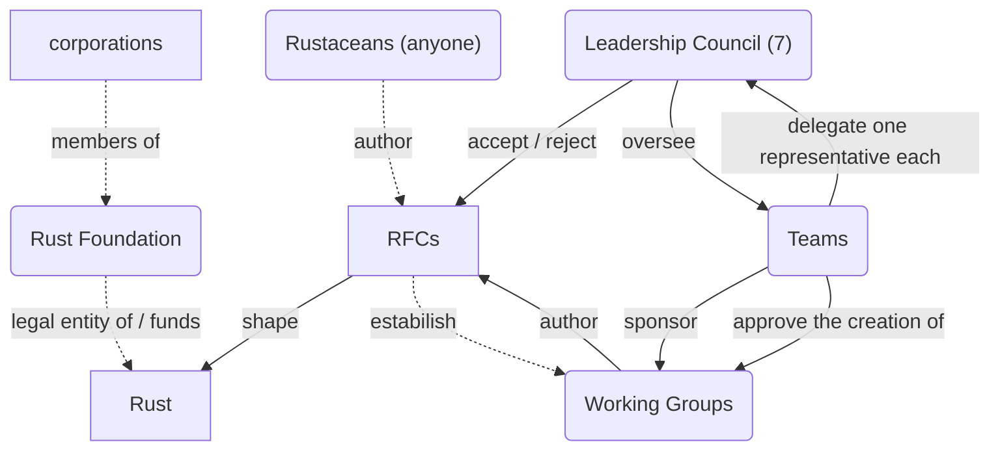
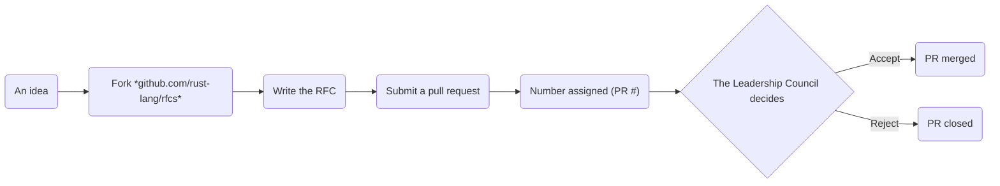

Gyöngyösi Máté

# The organization of Python development

<!--
- in connection with lesson 7 (collaborative development)
- BProf: started with Python
    - still the most convenient for me
- bumped into a bug report
-->

---
layout: image
image: /issue.png

transition: slide-up
---

---
layout: section

transition: slide-left
---

# Python history

---
layout: center

transition: slide-left
---


<!--
- invented by Guido van Rossum (xidoː vɑn rɔsʏm) (https://translate.google.com/?sl=nl&tl=en&text=Guido%20van%20Rossum&op=translate)
    - in 1991
    - at the Dutch MTA
- continued working on it part-time at Google (2005–2012) and Dropbox (2013–2019)
-->

---
# layout: iframe

transition: slide-up
---

<SlidevVideo controls autoplay autoreset="click">
  <source src="/programming-languages.mp4" type="video/mp4" />
</SlidevVideo>

<!--
- `0.9` @ 1991
- `2.0` @ 2000
- `3.0` @ 2008
    - made it popular
-->

---
layout: section

transition: slide-left
---

# Python governance

---
src: ./pages/Python.md

transition: slide-up
---

---
layout: section

transition: slide-left
---

# What is Python?

---
layout: iframe
url: https://docs.python.org/3/reference/index.html

transition: slide-left
---

---
layout: iframe
url: https://docs.python.org/3/library/index.html

transition: slide-down
---

---
src: ./pages/Python.md

transition: slide-up
---

---
layout: center
zoom: 2

transition: slide-down
---

<v-clicks>

```py{2|3|4|2}
implementations = [
    "CPython",  # NOT Cython
    "PyPy"  # NOT PyPI
    "Python.NET"  # pythonnet
]
```

</v-clicks>

<!--
- CPython is the reference implementation of Python
    - Cython is a superset of Python that supports calling C functions and types
- If you love recursion:
    - [click:2] A faster Python written in R(estricted)Python, a subset of Python
    - PyPy also has a tracing JIT compiler. PyPy was funded by the EU by 1 billion HUF and by the Mozilla Foundation by 100 million HUF
- [click] Embedding Python into .NET (NuGet package) & .NET into Python (PyPI package)
    - Funded by Microsoft
-->

---
src: ./pages/Python.md

transition: slide-left
---

---
transition: slide-left
---

# Release cycle


<!--
- stages
    - 1.5 years of development
    - 5 years of updates
        - 2 years of bugfixes
        - 3 years of security updates
    - every release is LTS
- altogether: 6.5 years
- the illustration is for the transition period
    - ended with the current release (`3.13`)
- what this means...
-->

---
layout: iframe
url: https://devguide.python.org/versions/

transition: slide-down
---

---
src: ./pages/Python.md

transition: slide-left
---

---
layout: center
class: text-center

transition: slide-up
---

# Join the PSF today!

[python.org/users/membership](https://www.python.org/users/membership/)

<!--
- create an account
- virtually sign the Code of Conduct
-->

---
layout: section

transition: slide-left
---

# Rust governance

---
src: ./pages/Python.md

transition: slide-left
---

---
layout: center
zoom: 2

transition: slide-left
---

Organogram



<!--
- MIT license and the Apache 2.0 License
    - portions covered by BSD-like licenses
-->

---
layout: center
zoom: 2.5

transition: slide-up
---

RFC process



<!--
- *"As an alternative, we could adopt an even stricter RFC process than the one proposed here. If desired, we should likely look to Python’s PEP process for inspiration."*
-->

---
layout: section

transition: slide-left
---

# vs. Python

---
layout: center
zoom: 2.5

transition: slide-left
---

PEP process


<!--
- if you have a larger screen, set the video quality to maximum
- discussions are public (lesson 7: collaborative development)
-->

---
layout: iframe
url: https://peps.python.org/pep-0010/

transition: slide-up
---

<!--
- Apache-like (lesson 8: governance)
-->

---
layout: section

transition: slide-left
---

# Opinion

<!--
- as said in lesson 7 (collaborative development): looks are important
-->

---
src: ./pages/PEPs.md
---

<!--
- they have a JSON API
-->

---
transition: slide-up
---

```py
from datetime import datetime
import json
import requests

peps_json = json.loads(requests.get("https://peps.python.org/api/peps.json").text)
peps = [value for key, value in peps_json.items()]
peps = sorted(peps, key=lambda pep: datetime.strptime(pep["created"], "%d-%b-%Y"))

retrospect = 5
print(f"The last {retrospect} PEPs are:")
for pep in peps[-retrospect:]:
    print(f"- PEP {pep["number"]} created on {pep["created"]}: {pep["title"]}")
```

<v-click>
```md {*}{lines: false}
The last 5 PEPs are:
- PEP 763 created on 24-Oct-2024: Limiting deletions on PyPI
- PEP 765 created on 15-Nov-2024: Disallow return/break/continue that exit a finally block
- PEP 766 created on 18-Nov-2024: Explicit Priority Choices Among Multiple Indexes
- PEP 767 created on 18-Nov-2024: Annotating Read-Only Attributes
- PEP 768 created on 25-Nov-2024: Safe external debugger interface for CPython
```
</v-click>

<!--
- can quickly see that the project is well alive
-->

---
src: ./pages/PEPs.md
---

<!--
- click on PEP 11
- everything is there
    - TOC
    - authors
    - date
    - etc.
-->

---
layout: iframe
url: https://rust-lang.github.io/rfcs/
---

<!--
- RFC organization
    - scroll down
    - click on '3550-new-range'
    - scroll down to 'Unresolved questions'
- no API

- groups have several different names
- harder to understand the dev process

- but it's understandable from a smaller community
- it's more like a meritoracy (lesson 8: governance)

- Python moved from a Mercurial Git repo and the Roundup issue tracker to GitHub (2017)
    - some did not make the transition
-->

---
layout: two-cols

transition: slide-up
---


::right::


<!--
- Eric S. Raymond
- Just van Rossum, Guido's brother
-->

---
zoom: 0.546

transition: slide-left
---

# References

- [1] C. F. Bolz-Tereick, ‘The First 15 Years of PyPy — a Personal Retrospective’. Accessed: Dec. 08, 2024. [Online]. Available: https://pypy.org/posts/2018/09/the-first-15-years-of-pypy-3412615975376972020.html
- [2] bstrie and B. Anderson, ‘0002-rfc-process’. Mar. 11, 2014. Accessed: Dec. 10, 2024. [Online]. Available: https://rust-lang.github.io/rfcs/0002-rfc-process.html
- [3] Cython developers, ‘About Cython’. Accessed: Dec. 08, 2024. [Online]. Available: https://cython.org/
- [4] Data Is Beautiful, Most Popular Programming Languages 1965 - 2022, (Dec. 12, 2022). Accessed: Dec. 10, 2024. [Online Video]. Available: https://www.youtube.com/watch?v=qQXXI5QFUfw
- [5] S. J. Turner et al., ‘3392-leadership-council’. Aug. 01, 2022. Accessed: Dec. 10, 2024. [Online]. Available: https://rust-lang.github.io/rfcs/3392-leadership-council.html
- [6]. NET Foundation, ‘Python.NET documentation’. 2022. Accessed: Dec. 08, 2024. [Online]. Available: https://pythonnet.github.io/pythonnet/
- [7]. NET Foundation, .‘NET Foundation’. 2024. Accessed: Dec. 08, 2024. [Online]. Available: https://dotnetfoundation.org/
- [8] Python Software Foundation, ‘Experts index’. 2011. Accessed: Dec. 10, 2024. [Online]. Available: https://devguide.python.org/core-developers/experts/#
- [9] Python Software Foundation, ‘About the Python Software Foundation’. 2024. Accessed: Dec. 09, 2024. [Online]. Available: https://www.python.org/psf/about/
- [10] Python Software Foundation, ‘The Python Language Reference’. 2024. Accessed: Dec. 08, 2024. [Online]. Available: https://docs.python.org/3/reference/index.html
- [11] Python Software Foundation, ‘The Python Standard Library’. 2024. Accessed: Dec. 08, 2024. [Online]. Available: https://docs.python.org/3/library/index.html
- [12] Rust Team, ‘Governance’. Accessed: Dec. 10, 2024. [Online]. Available: https://www.rust-lang.org/governance
- [13] The PEP Editors, ‘PEP 0 – Index of Python Enhancement Proposals (PEPs)’. Jul. 13, 2000. Accessed: Dec. 10, 2024. [Online]. Available: https://peps.python.org
- [14] The PyPy Team, ‘PyPy’. 2024. Accessed: Dec. 08, 2024. [Online]. Available: https://pypy.org/
- [15] The Python core team and community, ‘PEP 13 – Python Language Governance’. Dec. 16, 2018. Accessed: Dec. 09, 2024. [Online]. Available: https://peps.python.org/pep-0013/
- [16] A. Turon, ‘1068-rust-governance’. Feb. 27, 2015. Accessed: Dec. 10, 2024. [Online]. Available: https://rust-lang.github.io/rfcs/1068-rust-governance.html
- [17] G. Van Rossum, ‘Personal Home Page’. Accessed: Dec. 08, 2024. [Online]. Available: https://gvanrossum.github.io
- [18] M. Von Löwis and B. Cannon, ‘PEP 11 – CPython platform support’. Jul. 07, 2002. Accessed: Dec. 10, 2024. [Online]. Available: https://peps.python.org/pep-0011/
- [19] B. Warsaw, J. Hylton, D. Goodger, and A. Coghlan, ‘PEP 1 – PEP Purpose and Guidelines’. Jun. 13, 2000. Accessed: Dec. 09, 2024. [Online]. Available: https://peps.python.org/pep-0001/
- [20] Wikipedia contributors, ‘Guido van Rossum — Wikipedia, The Free Encyclopedia’. 2024. [Online]. Available: https://en.wikipedia.org/w/index.php?title=Guido_van_Rossum&oldid=1261004768
- [21] Wikipedia contributors, ‘Python (programming language) — Wikipedia, The Free Encyclopedia’. 2024. [Online]. Available: https://en.wikipedia.org/w/index.php?title=Python_(programming_language)&oldid=1261797535
- [22] Wikipedia contributors, ‘Python Software Foundation — Wikipedia, The Free Encyclopedia’. 2024. [Online]. Available: https://en.wikipedia.org/w/index.php?title=Python_Software_Foundation&oldid=1261952004
- [23] Wikipedia contributors, ‘Rust (programming language) — Wikipedia, The Free Encyclopedia’. 2024. [Online]. Available: https://en.wikipedia.org/w/index.php?title=Rust_(programming_language)&oldid=1261392251
- [24] XAMPPRocky, N. Matsakis, and valgrimm, ‘2856-project-groups’. May 21, 2015. Accessed: Dec. 10, 2024. [Online]. Available: https://rust-lang.github.io/rfcs/2856-project-groups.html


---
transition: slide-left
---

# Made with

| | |
|-|-|
|  | [Visual Studio Code](https://github.com/microsoft/vscode) |
|  | [`yt-dlp`](https://github.com/yt-dlp/yt-dlp) |
|  | [`ffmpeg`](https://git.ffmpeg.org/ffmpeg.git) |
|  | [Mermaid](https://github.com/mermaid-js/mermaid) |
|  | [Zotero](https://github.com/zotero/zotero) |

<PoweredBySlidev mt-6/>

<!--
- we talked about Zotero vs. EndNote in lesson 3 (legal)
-->

---
layout: statement

transition: slide-up
---

https://github.com/gy-mate/talks/tree/main/2024-12-10_BME_FLOSS_assignment

---
layout: center
zoom: 2.5
---

```py {lines: true}
sys.exit()
```

<!--
- questions: Teams
- good luck with the exams
- Merry Christmas
-->
